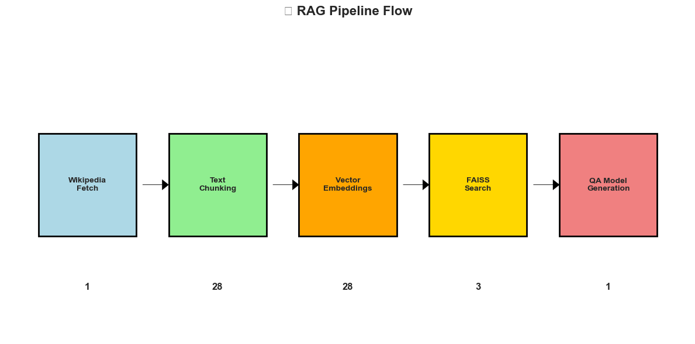

# 🔍 QnA RAG Pipeline For LLMs 🚀


## 📖 Project Overview

A complete **Retrieval-Augmented Generation (RAG)** pipeline implementation using state-of-the-art language models and vector databases. This system intelligently retrieves relevant information from Wikipedia articles and generates accurate, context-aware answers to user questions with confidence scoring.

## Deployed as Web Applications on: 

**1.** [Link to Hugging Face Spaces (Gradio)](https://huggingface.co/spaces/Mehardeep7/rag-pipeline-llm)

**2.** [Link to Streamlit App](https://wikipedia-rag-pipeline-llm.streamlit.app/)

<p align="center">
  
</p>

<p align="center"><em>RAG Pipeline Flow Diagram
  
📊 Pipeline Summary:

Input: 1 Wikipedia article

Chunks created: 28

Embeddings generated: 28

Relevant chunks retrieved: 3

Final answer generated: 1

</em></p>


## ✨ Key Features

- 📚 **Dynamic Knowledge Retrieval** from Wikipedia with error handling
- 🧮 **Semantic Search** using sentence transformers (no keyword dependency)
- ⚡ **Fast Vector Similarity** with FAISS indexing (sub-second search)
- 🤖 **Intelligent Answer Generation** using pre-trained QA models
- 📊 **Confidence Scoring** for answer quality assessment
- 🎛️ **Customizable Parameters** (chunk size, retrieval count, overlap)
- ✂️ **Smart Text Chunking** with overlapping segments for context preservation

## 🏗️ Architecture

```
User Query → Embedding → FAISS Search → Retrieve Chunks → QA Model → Answer + Confidence
     ↓              ↓            ↓              ↓              ↓              ↓
"How many times    [0.2, 0.8,   Find top-k     ["Real Madrid  RoBERTa Model  "15 times"
 has Real Madrid   -0.1, ...]   similar        won 15 times   Processes      (92.3% conf)
 won Champions                   chunks         ..."]          Context
 League?"
```

## 🛠️ Tech Stack & Models

**🔧 Core Technologies:**
- **🤗 Transformers**: For tokenization and question-answering models
- **📝 Sentence Transformers**: For semantic embeddings
- **⚡ FAISS**: For efficient vector similarity search
- **📖 Wikipedia API**: For knowledge base content
- **🐍 Python**: Core implementation language

**🤖 AI Models Used:**
- **📏 Text Chunking**: `sentence-transformers/all-mpnet-base-v2` tokenizer
- **🧮 Vector Embeddings**: `sentence-transformers/all-mpnet-base-v2` (768-dimensional)
- **❓ Question Answering**: `deepset/roberta-base-squad2` (RoBERTa fine-tuned on SQuAD 2.0) HuggingFace
- **🔍 Vector Search**: FAISS IndexFlatL2 for L2 distance similarity

## 🚀 Quick Start

### 📦 Installation

1. **Clone the repository:**
```bash
git clone https://github.com/yourusername/RAG_Pipeline_LLM.git
cd RAG_Pipeline_LLM
```

2. **Install dependencies:**
```bash
pip install -r requirements.txt
```
**OR**
```bash
pip install wikipedia transformers sentence-transformers faiss-cpu tf_keras numpy
```

3. **Choose your interface:**

**Option A: Streamlit Web Interface**
```bash
streamlit run streamlit_app.py
```

**Option B: Gradio Web Interface (Recommended for Sharing)**
```bash
# Local mode (safe, no antivirus conflicts)
python gradio_app.py

# With public sharing (may trigger antivirus warnings)
python gradio_app.py --share

```

**Option C: Jupyter Notebook**
```bash
jupyter notebook RAG_Pipeline_LLM.ipynb
```

### 📋 Usage Guide

**🌐 Streamlit Interface:**
1. **Launch App**: Run `streamlit run streamlit_app.py`
2. **Enter Topic**: Type any Wikipedia topic in the input field
3. **Process Content**: Click "Fetch & Process Article" and wait for completion
4. **Ask Questions**: Enter your question and click "Get Answer"
5. **Explore Results**: View answers, confidence scores, and interactive visualizations
6. **Analyze Performance**: Check chunk distributions and similarity scores

**🎨 Gradio Interface (Shareable):**
1. **Launch App**: Run `python gradio_app.py`
2. **Load Models**: Click "Load Models" in System Controls tab (first time only)
3. **Process Article**: Enter Wikipedia topic and configure chunk settings
4. **Ask Questions**: Switch to Q&A tab and enter your questions
5. **View Analytics**: Explore similarity scores and confidence metrics
6. **Share**: Use the public Gradio link to share with others

**📓 Jupyter Notebook:**
1. **Install Dependencies**: Execute the installation cell
2. **Import Libraries**: Run the imports cell
3. **Choose Topic**: Enter any Wikipedia topic when prompted
4. **Process Content**: Let the system automatically chunk and embed the content
5. **Ask Questions**: Query the knowledge base with natural language questions
6. **Review Results**: Get answers with confidence scores and visualizations

### 💡 Example Usage

```
Enter a topic to learn about: Artificial Intelligence
Total chunks: 45

Ask a question about the topic: What is machine learning?
Retrieved chunks: [3 most relevant chunks displayed]

Answer: Machine learning is a subset of artificial intelligence...
Confidence Score: 0.8974 (89.7%)
```

## 🎛️ Customization Options

The pipeline offers several parameters you can adjust:

- **Chunk Size**: Modify `chunk_size` parameter (default: 256 tokens)
- **Overlap**: Adjust `chunk_overlap` for context preservation (default: 20 tokens)
- **Retrieval Count**: Change `k` value for more/fewer retrieved chunks (default: 3)
- **Models**: Swap embedding or QA models for different performance characteristics

```python
# Example customizations
chunks = split_text(document, chunk_size=512, chunk_overlap=50)  # Larger chunks
k = 5  # Retrieve more chunks for broader context

# Hugging Face model loading examples
from transformers import AutoTokenizer, AutoModelForQuestionAnswering, pipeline

# Load models directly from Hugging Face Hub
tokenizer = AutoTokenizer.from_pretrained("sentence-transformers/all-mpnet-base-v2")
qa_model = AutoModelForQuestionAnswering.from_pretrained("deepset/roberta-base-squad2")
qa_pipeline = pipeline("question-answering", model=qa_model, tokenizer=tokenizer)
```

## 📁 Project Structure

```
RAG_Pipeline_LLM/
├── RAG_Pipeline_LLM.ipynb    # Main implementation notebook
├── streamlit_app.py          # Streamlit web interface
├── gradio_app.py            # Gradio web interface (recommended)
├── app.py                   # HF Spaces optimized Gradio app
├── README.md                # Project documentation
├── requirements.txt         # Python dependencies
```

## 🔬 How It Works

### 1️⃣ **Knowledge Acquisition**
- Fetches Wikipedia articles on user-specified topics
- Handles disambiguation and missing pages gracefully
- Validates content before processing

### 2️⃣ **Text Preprocessing**
- Splits long articles into manageable chunks (256 tokens)
- Maintains context with overlapping segments (20 tokens)
- Optimizes for both retrieval accuracy and processing efficiency

### 3️⃣ **Vector Embedding**
- Converts text chunks to 768-dimensional vectors using `all-mpnet-base-v2`
- Captures semantic meaning beyond keyword matching
- Creates searchable mathematical representations

### 4️⃣ **Indexing & Search**
- Stores embeddings in FAISS index for fast similarity search
- Uses L2 distance for measuring semantic similarity
- Enables sub-second retrieval from thousands of chunks

### 5️⃣ **Answer Generation**
- Uses RoBERTa model fine-tuned on SQuAD 2.0 dataset via Hugging Face Hub
- Leverages `transformers.pipeline()` for streamlined question-answering
- Performs extractive QA (finds answers within context)
- Provides confidence scores for answer reliability
- Automatic model downloading and caching through Hugging Face infrastructure

## 📊 Performance & Metrics

- **Search Speed**: Sub-second retrieval for 1000+ chunks
- **Accuracy**: High precision with confidence scoring
- **Memory Efficient**: Optimized chunk sizes prevent token overflow
- **Scalable**: Easy to extend to multiple knowledge sources

## 🔮 Future Enhancements

- 🌐 **Multi-source Knowledge**: Extend beyond Wikipedia to web scraping, PDFs, databases
- 💾 **Persistent Storage**: Save embeddings for reuse across sessions
- 🎨 **Web Interface**: Create user-friendly UI with Streamlit/Gradio
- 📈 **Advanced Retrieval**: Implement re-ranking, query expansion, and hybrid search
- 🤖 **Custom Models**: Fine-tune models on domain-specific data
- 🔄 **Real-time Updates**: Dynamic knowledge base updates
- 📱 **API Integration**: REST API for production deployment


## 🚀 Deployment Options

### 🎨 **Gradio on Hugging Face Spaces (Recommended)**

#### **🌐 Live Demo**: [RAG Pipeline on HF Spaces](https://huggingface.co/spaces/Mehardeep7/rag-pipeline-llm)

#### **📋 Deploy Your Own:**

1. **Fork this repository** to your GitHub
2. **Create HF Space**: Go to [huggingface.co/spaces](https://huggingface.co/spaces)
3. **Configure Space**:
   - SDK: Gradio
   - Files: Upload `app.py` and `requirements.txt`
4. **Benefits**: Free hosting, permanent links, GPU upgrades available

#### **🔧 Local Gradio Development:**
```bash
# Clone and run locally
git clone https://github.com/Mehardeep79/RAG_Pipeline_LLM.git
cd RAG_Pipeline_LLM
pip install -r requirements.txt
python gradio_app.py
```

### 🌐 **Streamlit Cloud Deployment**

1. **Fork/Upload** this repository to GitHub
2. **Connect** to [Streamlit Cloud](https://streamlit.io/cloud)
3. **Deploy** using `streamlit_app.py` as the main file
4. **Wait** for dependencies to install (first deployment takes 5-10 minutes)


## 📞 Contact 

- **📧 Email**: sandhu.mehardeep792003@gmail.com
- **🐙 GitHub**: [Mehardeep79](https://github.com/Mehardeep79)
- **💼 LinkedIn**: [Mehardeep Singh Sandhu](https://www.linkedin.com/in/mehardeep-singh-sandhu/)

---

